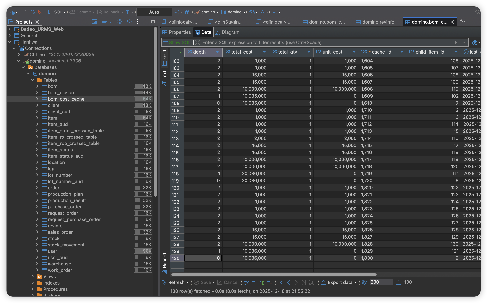
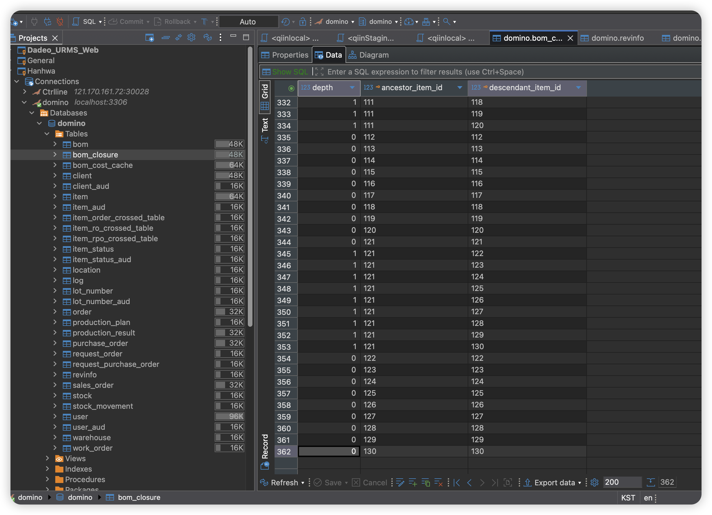
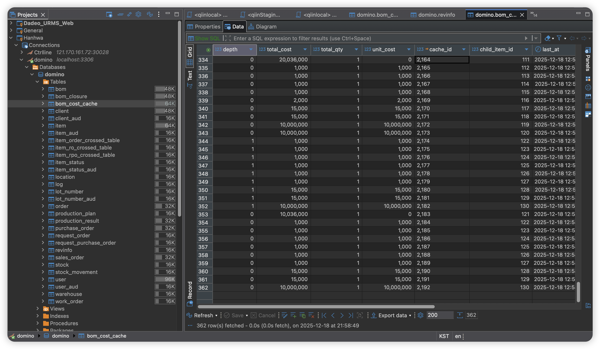

## 1. 문제 상황 요약

이슈 요약:  
`BOM` 생성/수정(create/update) 시점에 **자동으로 원가 캐시 재생성(비용 계산) 로직이 트리거되는 구조** 때문에,

- `BOM` 구조(및 클로저 테이블)와 `bom_cost_cache` 간의 **데이터 일관성 붕괴**
- 뉴먼(Newman)을 통한 대량 BOM 생성/수정 시 **성능 저하 및 처리 지연**
- `BOM` 도메인 서비스가 **원가 계산 책임까지 떠안는 SRP 위반 및 트랜잭션 경계 불명확**

문제가 동시에 발생하였다.  
이 문서는 왜 “BOM 생성/수정 시 자동 재빌드” 설계가 근본적으로 잘못되었는지, 그리고 어떤 방향으로 구조를 재정렬해야 하는지에 대한 설계 관점의 트러블슈팅 기록이다.

## 2. 발생 배경 (도메인 및 기존 설계 의도)

### 2.1 도메인 배경

- 본 시스템은 **ERP 스타일의 BOM(자재명세서)** 도메인을 다룬다.
  - `Item` : 품목
  - `BOM` : 부모–자식 관계로 표현되는 자재 구조
  - `BOM Closure` : 전개/역전개를 위한 클로저 테이블
  - `bom_cost_cache` : BOM 구조와 품목 단가를 기반으로 계산된 **소요량/원가 결과를 물리 테이블로 저장**하는 구조
- ERP 문맥에서:
  - `BOM` 생성/수정/삭제는 **구조(Structure) 변경 작업**이다.
  - 원가/소요량 계산은 별도의 **비즈니스 작업(예: “원가 계산 실행”, “결산용 BOM 원가 산출”)**으로 취급되어야 한다.

### 2.2 기존 설계 의도(추정)

코드를 기반으로 추정되는 기존 설계 의도는 다음과 같다.

- **항상 최신에 가까운 원가 정보 제공**  
  - 사용자 입장에서 “BOM을 수정했으면, 그 즉시 계산 결과도 최신이었으면 좋겠다”는 요구(또는 개발자의 기대)를 반영하려 했다.
  - 이를 위해 BOM 변경(create/update/delete) 시, 이벤트/서비스를 통해 `bom_cost_cache`를 **자동으로 무효화 + 재계산**하도록 설계되었다.

- **메인 트랜잭션과 계산 비용 분리**  
  - BOM 변경 트랜잭션을 빠르게 커밋하고, 비용이 큰 원가 계산은 별도의 비동기 워커/서비스에서 수행함으로써, 사용자 응답 속도를 개선하려는 의도가 있었다.

- **운영자/사용자의 명시적 조작 없이도 편리한 동기화**  
  - 별도의 “원가 계산 실행” 버튼이나 배치 작업 없이, BOM 변경만 하면 자동으로 결과가 맞춰지도록 하는 설계였다.

의도 자체는 “편의성과 응답 속도” 관점에서는 이해 가능하지만, **ERP 원가/BOM 도메인에서 요구되는 일관성과 책임 분리 원칙**과 충돌하게 되었다.

## 3. 기존 설계 구조 설명

기존 BOM–원가 캐시 구조는 개략적으로 다음과 같이 동작했다.

1. **BOM 생성/수정 시점**
   - `BomCommandService`에서 BOM 관계를 생성하거나 수정한다.
   - 동시에:
     - `BomClosure` 테이블을 업데이트(클로저 재구성)하고,
     - BOM 변경을 알리는 이벤트(`BomChangedEvent`)를 발행하거나,
     - 혹은 직접 `BomCacheService`를 호출하여 `bom_cost_cache`를 재빌드하는 로직이 존재했다.

2. **이벤트 리스너 및 비동기 워커**
   - `BomChangedEventListener`가 이벤트를 수신한다.
   - 내부에서 `CacheRebuildWorker` 등에 원가 캐시 재생성 작업을 큐잉(enqueue)한다.
   - 별도 스레드/실행 컨텍스트에서:
     - 대상 루트 품목에 대한 `bom_cost_cache`를 삭제하고,
     - `BomCacheBuilder`를 통해 해당 루트 품목 기준으로 전체 BOM 트리를 DFS로 순회하며 원가/소요량을 다시 계산,
     - 계산된 결과를 `bom_cost_cache` 테이블에 일괄 저장한다.

3. **조회 서비스**
   - 조회 서비스(`BomQueryServiceImpl`)는:
     - `bom_cost_cache`를 기준으로 정전개/역전개/원재료 리스트 등을 응답에 구성하고,
     - 경우에 따라 캐시가 비어 있으면 **조회 시점에 즉시 계산 + 저장**하는 논리도 포함하고 있었다.

이 구조에서 핵심 문제는, **BOM 구조 변경과 원가 계산이 “명시적인 비즈니스 유스케이스”가 아니라, 서로의 부수 효과(side effect)로 묶여 있었다**는 점이다.

## 4. 실제로 발생한 문제

### 4.1 데이터 일관성 문제

- BOM 생성/수정이 커밋된 직후, 비동기 캐시 재빌드가 아직 완료되지 않은 시점에:
  - `bom`/`bom_closure` 테이블은 **새로운 구조**를 반영하고,
  - `bom_cost_cache`는 **이전 구조나 이전 단가 기준으로 계산된 결과**를 그대로 가지고 있는 상태가 될 수 있다.
- 이 상태에서:
  - BOM 트리 + 원가를 조회하는 API를 호출하면,
  - 구조는 업데이트된 BOM 기준인데, 비용/소요량은 이전 계산 결과가 섞여 있는 **중간 상태(in-between state)**가 노출된다.
- 결과적으로:
  - “이 화면에 보이는 원가가 어느 시점의 BOM 구조를 기준으로 계산된 값인지”를 신뢰하기 어려운 상황이 된다.

### 4.2 뉴먼(Newman) 기반 대량 생성 시 성능 저하

- `resources/newman/bom_collection.json`과 같은 시나리오를 통해, BOM을 연속적으로 다수 생성/수정하는 배치성 호출이 수행되었다.
- 이 때, **각 BOM 생성/수정마다 자동으로 원가 캐시 재계산 로직이 트리거**되면서:
  - 동일하거나 유사한 BOM 구조에 대해 **과도하게 반복 계산**이 발생한다.
  - DB I/O, BOM 트리 DFS 연산, `bom_cost_cache` 전체 삭제 및 재삽입 등의 비용이 반복 누적되어 **응답 지연과 전체 처리 시간 증가**로 이어졌다.

### 4.3 SRP 및 책임 경계 혼란

- BOM 도메인 서비스가:
  - BOM 구조 변경(관계 저장, 클로저 관리)
  - 원가 계산 트리거(이벤트 발행, 캐시 서비스 호출)
  - 두 역할을 모두 수행하면서, **단일 책임 원칙(SRP)을 벗어난 구조**가 되었다.
- 트랜잭션 경계 관점에서도:
  - BOM 변경 트랜잭션은 명확하지만,
  - 해당 변경에 따라 **어느 시점에 어떤 기준으로 원가가 재계산되었는지**는 서비스 코드/이벤트 흐름을 따라가 보지 않으면 알 수 없는 상태가 되었다.

## 5. 문제의 핵심 원인 분석

### 5.1 “BOM 생성/수정 = 계산 트리거”라는 잘못된 전제

- 가장 근본적인 원인은, 설계 상:
  - “BOM이 변경되면 곧바로 원가도 최신 상태여야 한다”는 전제를 두고,
  - BOM 변경 자체를 **원가 계산의 트리거로 사용**했다는 점이다.
- 그러나 ERP 도메인에서 BOM 변경은 어디까지나 **구조 정의 작업**이며,
  - 원가 계산은 “결산 시점/기간/단가 기준” 등 다양한 조건을 고려해 **별도의 의사결정과 승인 프로세스**를 통과해야 하는 경우가 많다.
- 즉, “BOM 변경과 원가 계산을 하나의 흐름으로 엮어 버린 설계”가 근본 원인이다.

### 5.2 구조 변경 + 클로저 재구성 + 원가 캐시 재빌드의 강한 결합

- BOM 생성/수정 시:
  - 1) BOM 테이블 업데이트
  - 2) `BomClosure` 테이블 재구성
  - 3) `bom_cost_cache` 재빌드
  - 이 세 단계가 **한 흐름에서 자동 연결**되어 있었다.
- 이로 인해:
  - 클로저 테이블이 미세하게 달라져도, 전체 원가 캐시를 다시 빌드해야 하는 것처럼 동작했고,
  - 클로저/캐시 간의 경계가 모호해져, 어느 계층이 어떤 책임을 가지는지 명확하지 않게 되었다.

### 5.3 트랜잭션과 비동기 처리의 조합

- BOM 변경은 하나의 트랜잭션에서 완료되지만,
  - 이후 원가 캐시 재빌드는 별도의 비동기 워커에서, 별도 트랜잭션으로 실행된다.
- 이 구조에서는 다음과 같은 문제가 발생한다.
  - BOM 변경과 원가 계산이 **동일한 BOM 스냅샷을 기준으로 동작한다는 보장이 없다.**
  - 중간에 추가 BOM 변경이 발생해도, 이전 이벤트에 의해 큐잉된 재빌드 작업이 뒤늦게 실행될 수 있다.
  - 사용자는 언제 어떤 기준으로 계산되었는지를 서비스 동작만 보고는 이해하기 어렵다.

### 5.4 조회 시점 자동 계산과의 상호작용

- 일부 조회 로직은 `bom_cost_cache`가 비어 있을 경우, **조회 시점에 자동으로 계산 + 저장**하는 동작을 포함하고 있다.
- BOM 변경에 따른 비동기 재빌드, 조회 시점 자동 계산이 섞이면서:
  - “어떤 호출이 실제로 원가를 계산해서 저장했는지”
  - “새로운 BOM에 대한 결과인지, 이전 BOM에 대한 결과인지”
  - 가 더 모호해졌고, 디버깅/원인 추적이 어려워졌다.

## 6. 잘못된 설계 접근

이번 이슈를 통해 드러난 잘못된 설계 접근을 정리하면 다음과 같다.

1. **자동 동기화를 “도메인 규칙”으로 착각**  
   - “항상 최신 상태 유지”는 UX/성능 관점에서의 편의일 뿐, ERP 도메인에서 **필수 불변 규칙**이 아니다.
   - 그럼에도 불구하고 BOM 변경을 자동 원가 계산 트리거로 사용하면서, 실제 도메인 요구(명시적 원가 계산, 감사 가능성)를 무시했다.

2. **BOM 도메인 서비스에 과도한 책임 부여**
   - BOM 구조 관리 서비스가:
     - 구조 유효성 검증, 저장, 클로저 관리뿐 아니라,
     - 원가 캐시 무효화/재빌드까지 책임지는 구조가 되었다.
   - 이는 “한 서비스가 여러 도메인(구조, 원가)을 동시에 다루는” SRP 위반 사례이다.

3. **트랜잭션 경계를 고려하지 않은 비동기 이벤트 사용**
   - 이벤트를 통해 트랜잭션 경계를 넘는 계산 작업을 수행하면서,
   - “이벤트 발생 시점의 상태”와 “실제 계산 시점의 상태” 간 차이를 해소할 수 있는 버전 관리/스냅샷 개념이 없다.
   - 즉, 이벤트/비동기를 **단순한 비동기 작업 큐**로 사용했을 뿐, 도메인 일관성을 유지하기 위한 설계 요소로 활용하지 못했다.

4. **조회 계층에 계산 책임을 숨겨 둔 점**
   - 조회 시 자동 계산은 겉으로는 편리해 보이지만,
   - 결과적으로 “누가 언제 어떤 조건으로 계산을 실행했는지”를 코드 밖에서 추적하기 어렵게 만들었다.

## 7. 개선 방향 및 설계 원칙

이번 문제를 바탕으로, 향후 BOM–원가 계산 구조를 다음과 같은 방향으로 재정렬해야 한다.

### 7.1 명시적 사용자 트리거 기반의 계산 유스케이스

- 원가/소요량 계산은 **반드시 명시적인 유스케이스**로 다룬다.
  - 예: “선택한 BOM 루트 품목에 대해 BOM 원가 계산 실행”
  - 예: “전체 품목에 대한 BOM 원가 일괄 재계산(배치)”
- 사용자는:
  - BOM 구조를 충분히 조정한 뒤,
  - 별도의 UI/명령(버튼, 배치 실행)을 통해 “원가 계산”을 요청한다.
- 시스템은:
  - 이 요청을 기준으로 `bom_cost_cache`를 재계산/저장하고,
  - 필요한 경우 계산 시점/버전/요청자 정보를 메타데이터로 관리할 수 있다.

### 7.2 BOM 생성/수정 시 자동 재빌드 금지

- BOM 생성/수정/삭제 시:
  - **원가 계산 로직(캐시 재빌드)을 자동으로 호출하지 않는다.**
  - BOM 도메인 서비스는:
    - BOM 테이블
    - 클로저 테이블
  - 두 가지의 일관성과 무결성만을 책임지는 것으로 역할을 축소한다.
- 이를 통해:
  - BOM 구조 변경과 원가 계산의 **시간적·책임적 분리**가 이루어지고,
  - 대량 생성/수정(Newman 등) 시에도 불필요한 반복 계산을 피할 수 있다.

### 7.3 재빌드를 “비즈니스 연산”으로 취급

- `bom_cost_cache` 재생성(rebuild)은 단순한 **부수 효과(side effect)**가 아니라,
  - “어느 루트 품목에 대해”
  - “어떤 기준(단가, 시점 등)을 사용하여”
  - “누가/어떤 프로세스에 의해”
  - 실행했는지가 중요한 **비즈니스 연산**이다.
- 따라서:
  - BOM 변경 로직 내부가 아닌,
  - 별도의 애플리케이션 서비스/유스케이스를 통해 호출되어야 하며,
  - ERP 운영 팀이 “언제 어떤 이유로 재계산을 했는지”를 설명할 수 있는 형태가 되어야 한다.

### 7.4 이벤트/비동기 처리는 2차적 관심사에 한정

- BOM/원가 계산의 **진실한 상태(source of truth)**는 동기적이고 명시적인 유스케이스에서 결정되어야 한다.
- 이벤트/비동기 처리는:
  - 알림(Notification)
  - 통계 집계
  - 외부 시스템 연동
  - 등과 같은 **2차적 관심사(secondary concern)**로 제한하는 것이 바람직하다.
- 원가 계산 자체를 이벤트/비동기 기반으로 숨겨 두면:
  - 디버깅이 어려워지고,
  - 도메인 규칙을 이해하기 위해 인프라 레벨의 코드를 읽어야 하는 문제가 계속 반복된다.

### 7.5 트랜잭션 경계의 명확화

- BOM 구조 변경 트랜잭션:
  - BOM 및 클로저의 무결성을 책임진다.
  - 이 트랜잭션은 원가 계산 유스케이스와 느슨하게 연관될 뿐, 직접적인 연산을 포함하지 않는다.
- 원가 계산 트랜잭션:
  - 지정된 루트 품목(또는 전체 품목 집합)에 대해
  - 결정된 시점/버전의 BOM과 단가를 바탕으로
  - `bom_cost_cache`를 재계산/저장한다.
- 이렇게 경계를 나누면:
  - 각 트랜잭션이 어떤 도메인 상태를 책임지는지 명확해지고,
  - 장애/롤백/재시도 시에도 “어디까지가 완료되었는지”를 쉽게 설명할 수 있다.

## 8. 결론

- 이번 이슈의 핵심은, **“BOM 생성/수정 시 자동으로 원가 캐시를 재빌드하는 설계”가 ERP 스타일 BOM/원가 도메인이 요구하는 일관성·책임 분리·트랜잭션 명확성 원칙을 정면으로 위반했다**는 점이다.
- BOM 생성/수정은 어디까지나 **구조 변경 작업**이며, 원가 계산은 별도의 **명시적 비즈니스 연산**으로 다루어져야 한다.
- 자동 재빌드 설계는:
  - 데이터 일관성 붕괴,
  - Newman 기반 대량 처리 시 성능 저하,
  - SRP 및 트랜잭션 경계 모호성,
  - 비동기 처리로 인한 디버깅 난이도 증가
  - 를 동시에 유발하였다.
- 따라서 아키텍처 수준의 결정은 다음과 같이 정리할 수 있다.
  1. **BOM 생성/수정/삭제는 원가 계산을 트리거하지 않는다.**
  2. **원가 계산(`bom_cost_cache` 재빌드)은 명시적인 사용자/배치 트리거를 통해서만 실행된다.**
  3. **재빌드는 단순한 부수 효과가 아니라, 독립된 비즈니스 유스케이스로 설계한다.**
- 이 결론을 바탕으로, 추후 리팩토링 시에는 코드를 이 설계 원칙에 맞추어 단계적으로 정리해 나가야 하며, 본 문서는 그 과정에서 “왜 기존 자동 재빌드 구조가 잘못되었는지”를 설명하는 근거 문서로 활용될 수 있다.

## 문제 요약

- `bom_cost_cache`와 `bom_closure`의 행(row) 수가 **전면 재빌드 전/후에 크게 달라지는 현상**이 관측되었다.
  - 재빌드 전:
    - `bom_cost_cache` 행 수: **130**
    - `bom_closure` 행 수: **362**
  - `POST /api/v1/boms/cache/rebuild` 호출 후:
    - `bom_cost_cache` 행 수: **362** (클로저와 동일한 수준으로 증가)
- 이는 곧, BOM 생성/수정 시점에 자동으로 이루어지는 캐시 재빌드/갱신만으로는 **일관된 계산 결과 테이블(`bom_cost_cache`)을 보장하지 못한다**는 의미이며,
  - 결국 사용자가 **수동으로 전체 재빌드**를 한번 더 실행해야만 데이터가 맞춰지는 구조적 문제를 드러낸다.

## 증상 설명

- 운영/테스트 환경에서 다음과 같은 패턴이 반복적으로 관측되었다.
  - 여러 차례 BOM을 생성/수정한 뒤, `bom_cost_cache`와 `bom_closure`의 행 수를 비교하면:
    - `bom_closure`는 BOM 구조 전체를 잘 반영하고 있는 반면,
    - `bom_cost_cache`는 일부 루트/경로에 대해서만 계산 결과가 존재해, **행 수가 훨씬 적게(예: 130행)** 나타난다.
  - 이 상태에서 `POST /api/v1/boms/cache/rebuild`를 호출하면:
    - `bom_cost_cache`의 행 수가 **362행**까지 늘어나며,
    - 이후에야 `bom_closure`와 구조적으로 유사한 수준의 결과가 채워진다.
- 실제 사용자/테스터 입장에서는:
  - “BOM을 정상적으로 생성/수정했는데도, 화면에 보이는 원가/소요량 구조가 일부만 계산되어 있는 것처럼 보인다.”
  - “결국 매번 전면 재빌드를 눌러야만 데이터가 맞아 떨어진다.”
  - 라는 경험을 하게 되고, 시스템이 **스스로 일관성을 유지하지 못한다는 불신**을 갖게 된다.

## 데이터 불일치 분석

### 1) 스크린샷으로 보는 행 수 불일치

- **재빌드 전 `bom_cost_cache` 행 수 130 (이미지 1)**  

  

  - 일부 루트 품목에 대해서만 원가 계산이 이루어져, `bom_cost_cache`에 저장된 결과가 **130행**에 불과한 상태를 보여준다.

- **재빌드 전 `bom_closure` 행 수 362 (이미지 2)**

  

  - 동일 시점에 `bom_closure`는 전체 BOM 구조를 반영하고 있으며, **362행**이 존재한다.
  - 즉, 구조 정보(closure)는 충분히 채워져 있지만, 계산 결과 테이블(`bom_cost_cache`)은 그 절반 이하만 채워져 있는 상태이다.

- **`POST http://localhost:8080/api/v1/boms/cache/rebuild` 호출 후 `bom_cost_cache` 행 수 362 (이미지 3)**

  

  - 전면 재빌드 API를 호출한 이후에는 `bom_cost_cache` 행 수가 **362행**으로 증가하여, `bom_closure`와 거의 1:1에 가까운 수준으로 맞춰진다.
  - 이 사실은, **현재 구조에서는 수동 전체 재빌드를 수행해야만 계산 결과 테이블이 구조 테이블과 같은 스케일로 채워진다**는 점을 시각적으로 보여준다.

- 요약하면:
  - 자동/부분 계산만 거친 상태에서는 `bom_cost_cache`가 **항상 불완전한(partial) 상태**에 머물고,
  - 전면 재빌드(`POST /api/v1/boms/cache/rebuild`)를 수행해야만 비로소 `bom_closure`와 유사한 범위를 커버하게 된다.
  - 이는 “자동 재빌드가 실제로는 전체 일관성을 책임지지 못하고 있으며, **수동 전면 재빌드를 강제하는 설계**”라는 점을 명확히 드러낸다.

### 2) `bom_cost_cache` 행 수가 재빌드에 의존하는 이유

- 재빌드 전 행 수(`bom_cost_cache`: 130)는, 과거에 **부분적으로 계산되었던 루트 품목**들에 대해서만 결과가 저장된 상태를 반영한다.
  - 예:
    - 특정 시점에 일부 루트 품목에 대한 원가 계산이 실행되었고,
    - 다른 루트 품목에 대해서는 아직 계산이 수행되지 않았거나, 중간에 실패/중단되었을 수 있다.
- `POST /api/v1/boms/cache/rebuild`는:
  - 모든 유효한 루트 품목을 찾아 순회하면서,
  - 각 루트 기준으로 BOM 트리를 완전 탐색하여 계산 결과를 `bom_cost_cache`에 채운다.
  - 그 결과, `bom_closure`와 비슷한 수준의 행 수인 **362행**이 채워지게 된다.
- 즉, 기존 구조에서는:
  - BOM 생성/수정 시점의 자동 재빌드/갱신 로직만으로는 **전체 BOM 구조에 대한 “완전한” 계산 테이블를 유지하지 못하고**,
  - 전면 재빌드를 수행해야만 `bom_cost_cache`가 `bom_closure` 수준으로 채워지는 상황이다.

### 3) 생성/수정 트리거로는 왜 일관된 캐시 상태를 만들 수 없는가

- BOM 생성/수정 이벤트는 **해당 시점에 변경된 특정 관계/루트에 대해서만** 원가 캐시를 만지려는 경향이 있다.
  - 예를 들어, 어떤 자식 노드가 새로 추가되었을 경우:
    - 그 자식이 포함된 일부 루트들에 대해서만 재계산이 이루어질 수 있다.
- 그러나 BOM 구조는 **다수의 루트/경로를 공유**할 수 있으며,
  - 하나의 변경이 여러 상위 BOM, 여러 루트 BOM에 동시에 영향을 미칠 수 있다.
- 이때:
  - 모든 영향 경로를 누락 없이 찾아서 **해당 루트들에 대한 캐시까지 완전히 갱신**하지 않으면,
  - `bom_cost_cache`는 항상 “부분적으로만 업데이트된 상태”로 남게 된다.
- 실제로 관측된 `130 → 362` 행 수 증가는,
  - 자동/부분 업데이트만으로는 “전체 영향 범위”를 커버하지 못하고 있었고,
  - 전면 재빌드 시에야 비로소 **모든 루트/경로에 대한 결과가 생성되었다**는 사실을 수치로 보여준다.

## 설계적 원인 (SRP 위반 중심)

### 1) 구조 변경과 계산 책임의 혼합

- BOM 생성/수정 로직은 본질적으로:
  - `bom` 테이블에 구조를 기록하고,
  - `bom_closure` 테이블을 통해 전개/역전개를 위한 경로 정보를 유지하는 역할에 집중해야 한다.
- 그러나 현 설계에서는:
  - 동일한 흐름 안에서 **원가 계산 또는 캐시 재빌드 트리거**까지 담당하고 있다.
  - 즉, “구조 정의” 단계에서 “계산 실행”이라는 전혀 다른 도메인 책임을 함께 수행하는 구조이다.
- 이로 인해:
  - 구조 변경이 잦아질수록 계산 책임도 함께 폭증하고,
  - 어떤 경우에는 구조 변경은 성공했지만 계산은 일부만 반영된 상태가 되며,
  - **단일 책임 원칙(SRP)이 무너지고, BOM 도메인의 경계가 흐려진다.**

### 2) 계산 결과 테이블을 “캐시”로 오인한 점

- 이름은 `bom_cost_cache`이지만, 실제 역할은:
  - “BOM + 단가를 기반으로 산출된 원가/소요량 결과를 물리적으로 보존하는 **계산 테이블**”
  - 에 가깝다.
- 그럼에도 불구하고 일반적인 웹 캐시처럼:
  - 필요한 시점마다 자동으로 갱신/무효화해도 괜찮다고 가정하고,
  - 구조 변경 시 자동 재빌드, 조회 시 자동 계산 등을 혼합해 사용했다.
- ERP 관점에서 원가 계산 결과는:
  - 단순 캐시가 아니라 **의사결정과 감사(audit)의 대상**이 되는 데이터이다.
  - 이러한 데이터를 구조 변경의 부수 효과로 취급한 것이 SRP 위반의 직접적인 원인이 되었다.

## 왜 자동 rebuild가 실패하는가

### 1) 영향 범위 추론의 한계

- BOM은 트리/그래프 형태의 구조를 가지며,
  - 하나의 변경이 몇 단계 위의 루트, 여러 개의 상위 BOM에 동시에 영향을 미친다.
- BOM 생성/수정 트랜잭션 안에서:
  - 이 모든 영향을 정확하게 추론하고,
  - 모든 영향 루트에 대해 **완전한 재계산**을 수행하는 것은 사실상 어렵다.
- 따라서 자동 재빌드는:
  - 일부 루트/일부 경로만 갱신하고 지나가게 되고,
  - 결과적으로 `bom_cost_cache`가 **전면 재빌드 전까지는 항상 부분 상태**에 머물게 된다.

### 2) 비동기/이벤트 기반 처리와의 조합

- BOM 변경 후 이벤트를 발행하고,
  - 비동기 워커가 큐에서 작업을 가져와 재빌드를 수행하는 구조에서는,
  - “어느 시점의 BOM/Item 상태를 기준으로 계산했는지”를 보장하기 어렵다.
- 또한, 재빌드가 실행되기 전에:
  - 또 다른 BOM 변경이 발생할 수 있고,
  - 조회 시점 자동 계산과 뒤섞여 **중복/경합 상태**가 발생한다.
- 이 모든 흐름을 조합했을 때,
  - 자동 rebuild는 이론적으로도, 실무적으로도 **“항상 올바른 최종 상태를 만든다”는 보장을 제공하지 못한다.**

## ERP 관점에서 올바른 접근

### 1) 명시적 사용자 트리거 기반 계산

- BOM 구조 변경은 어디까지나 “구조 정의 작업”이다.
- 원가/소요량 계산은:
  - “원가 산출”, “BOM 원가 재계산”, “결산용 계산 실행” 등과 같은 **명시적인 비즈니스 행위**로 모델링해야 한다.
- 사용자는:
  - BOM을 여러 번 수정/정비한 뒤,
  - 필요 시점에 명시적으로 “계산하기” 버튼(또는 배치 작업)을 실행해 전체/선택 품목에 대한 계산을 수행한다.

### 2) 수동/명시적 재빌드를 전제로 한 일관성 모델

- `bom_cost_cache`는:
  - “마지막으로 성공적으로 계산된 시점”을 반영하는 결과 테이블로 간주하고,
  - 해당 시점 이전의 BOM/Item 상태를 기준으로 일관된 값을 제공해야 한다.
- BOM 변경이 발생해도,
  - 자동으로 이 테이블을 따라잡으려 하지 말고,
  - 명시적인 “재빌드” 작업이 있을 때만 한 번에 갱신하도록 한다.
- 이렇게 하면:
  - 재빌드 전에는 “이 결과는 마지막 계산 기준임”을 명확히 안내할 수 있고,
  - 재빌드 후에는 새로운 기준이 언제부터 유효한지 설명할 수 있다.

### 3) Cache-aside 패턴과의 정렬

- `bom_cost_cache`를 “진짜 캐시”가 아니라 **계산 결과 저장소**로 간주하되,
  - 조회 서비스는 이 테이블을 읽기만 하고,
  - 계산 실행/재빌드는 별도의 유스케이스가 명시적으로 호출한다.
- 필요한 경우에만:
  - 애플리케이션 레벨에서 “결과가 없으면 계산을 먼저 실행하라”는 **명령형 플로우**를 추가할 수 있지만,
  - 이 역시 사용자/배치가 의도적으로 호출해야지,
  - 단순 조회가 묵시적으로 계산을 수행해서는 안 된다.

## 현재 설계에서 반드시 인지해야 할 트레이드오프

- **속도 vs. 일관성**
  - 자동 재빌드는 이론상 “사용자가 기다리지 않아도 최신 상태를 제공한다”는 이점이 있지만,
  - 실제로는 일관된 상태를 보장하지 못하고,
  - Newman과 같은 대량 처리에서는 오히려 심각한 성능 저하를 야기한다.
  - ERP에서는 **사용자가 조금 더 기다리더라도, 결과가 신뢰 가능하고 설명 가능해야 한다.**

- **편의성 vs. 책임 명확성**
  - BOM 변경만으로 원가까지 자동으로 맞춰주는 편의성을 추구하다 보면,
  - 어디까지가 BOM 도메인의 책임이고,
  - 어디부터가 원가 도메인의 책임인지 불명확해진다.
  - 이는 유지보수/장기 운영 시에 더 큰 비용을 초래한다.

- **자동화 vs. 통제 가능성**
  - 자동 재빌드는 단기적으로는 “편리한 자동화”처럼 보이지만,
  - 장애/오류/데이터 불일치가 발생했을 때, **운영자가 상황을 통제하거나 복구·설명하기 어렵게 만든다.**
  - 명시적인 “계산 실행” 유스케이스로 전환하면, 자동화 수준은 조금 낮아질 수 있지만,
  - 대신 **언제·누가·어떤 기준으로 계산했는지**를 명확히 남길 수 있다.

- 결론적으로, 현재 설계에서는:
  - 자동 rebuild를 유지하는 대신,
  - **명시적 재빌드와 사용자 인지 가능한 원가 계산 흐름**으로 전환하는 것이,
  - ERP 시스템이 요구하는 신뢰성과 설명 가능성을 확보하는 데 더 적합한 트레이드오프이다.

